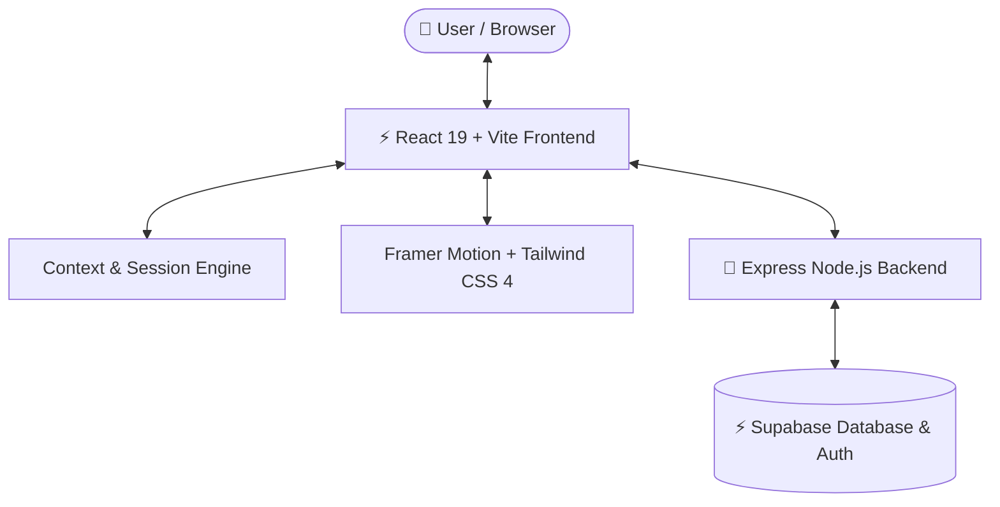

<div align="center">

  

  # Conversa 🗣️✨
  **Real-world Language Immersion & AI Roleplay Studio for Indian Languages**

  [](https://react.dev/)
  [](https://vitejs.dev/)
  [](https://www.typescriptlang.org/)
  [](https://tailwindcss.com/)
  [](https://nodejs.org/)
  [](https://supabase.com/)

  <p align="center">
    Master real-world conversational fluency through interactive AI roleplays, voice immersion, regional dialect nuance, and real-time AI speech debriefing.
  </p>

</div>

---

## 🌟 Overview

**Conversa** is a next-generation language immersion studio designed to bridge the gap between textbook language learning and authentic real-world conversations. 

Instead of passive flashcards, Conversa places you in dynamic, culturally rich scenarios across India—from bargaining for silk jackets in Mumbai's Colaba market to custom tea orders at an Ahmedabad chai stall or answering system architecture questions in a Bengaluru tech interview.

---

## 🚀 Key Features

### 🎭 Culturally Rich Immersion Arenas
- **Bambaiya Hindi:** Bargain with *Ramesh Lal* at Colaba Market, Mumbai.
- **Gujarati Hindi:** Order cutting chai & maska bun with *Karan Bhai* at Lal Darwaja, Ahmedabad.
- **Tech English:** Navigate system architecture interviews with *Shruti Hegde* in Indiranagar, Bengaluru.
- **Gujarati:** Negotiate auto-rickshaw fares with *Babubhai* in Navrangpura.
- **Bengali:** Purchase authentic Sandesh & Rasgulla with *Subir Da* at New Market, Kolkata.
- **Dilli Hindi:** Order customized chaat with *Raju Chaatwala* at Chandni Chowk, Delhi.
- **Tamil:** Sip traditional filter coffee with *Selvam* at Mylapore, Chennai.
- **Punjabi:** Experience dhaba hospitality with *Gurpreet Singh* at Amritsar.

### 🎙️ Push-to-Talk Voice Immersion
- **Real-Time Equalizer Waveforms:** Live dynamic audio frequency visualizer while speaking.
- **Voice Print Processing:** Speech-to-text integration with regional pronunciation tolerance.
- **Pulsing Audio Aura:** Multi-ring aura animations and responsive spring micro-interactions.

### 📊 AI Coach Performance Debrief
- **Fluency & Accuracy Meter:** Real-time percentage scoring with animated radial gauges.
- **Grammar & Mistake Detection:** Instant feedback pinpointing grammatical errors with corrected forms.
- **Natural Phrasing Suggestions:** Learn local idioms and how native speakers phrase expressions naturally.
- **Vocabulary Recap:** Saved key vocabulary cards with contextual translations.

### 🏆 Gamification & Progress Tracking
- **Daily Streak Counter:** Stay motivated with active streak fire tracking.
- **XP Point System:** Earn XP based on difficulty tier (Easy, Medium, Hard).
- **Session History:** Track progress across historical debriefs and review past conversations.

---

## 🛠️ Architecture & Tech Stack



| Layer | Technology |
| :--- | :--- |
| **Frontend Framework** | [React 19](https://react.dev/) + [TypeScript](https://www.typescriptlang.org/) |
| **Build Tool** | [Vite 8](https://vitejs.dev/) |
| **Styling & Design Tokens** | [Tailwind CSS v4](https://tailwindcss.com/) + Custom Glassmorphism |
| **Animations** | [Framer Motion](https://www.framer.com/motion/) |
| **Icons** | [Lucide React](https://lucide.dev/) |
| **Backend API** | [Node.js](https://nodejs.org/) + [Express](https://expressjs.com/) + TSX |
| **Database & Auth** | [Supabase JS Client](https://supabase.com/) |

---

## 📁 Project Structure

```text
Conversa/
├── frontend/                  # React 19 Vite Web App
│   ├── src/
│   │   ├── components/
│   │   │   ├── chat/          # MicButton, MessageBubble, ChatThread
│   │   │   ├── debrief/       # KeyMistakes, PhrasingComparison, VocabRecap
│   │   │   └── layout/        # ContextBanner, PageTransition
│   │   ├── context/           # SessionContext (State & Storage)
│   │   ├── data/              # Mock Scenarios & Personas
│   │   ├── pages/             # Landing, ScenarioSelect, Chat, Debrief, History, Login
│   │   ├── types/             # Scenario, Chat, & Session Type Definitions
│   │   ├── index.css          # Design Tokens, Keyframes, Glassmorphism
│   │   └── router.tsx         # React Router Configuration
│   ├── package.json
│   └── vite.config.ts
│
├── backend/                   # Express API Server
│   ├── src/
│   │   ├── index.ts           # Server Entry, CORS, Helmet, Rate Limiters
│   │   └── routes/            # Scenarios, Sessions, Auth endpoints
│   ├── package.json
│   └── tsconfig.json
│
└── README.md                  # Project Documentation
```

---

## ⚡ Getting Started

### Prerequisites
- **Node.js**: v18.0 or higher
- **npm**: v9.0 or higher

### Installation & Local Setup

1. **Clone the repository:**
   ```bash
   git clone https://github.com/AtharvaK-XD/Conversa.git
   cd Conversa
   ```

2. **Setup and launch the Frontend server:**
   ```bash
   cd frontend
   npm install
   npm run dev
   ```
   > The frontend dev server will launch at `http://localhost:5173`.

3. **Setup and launch the Backend server:**
   ```bash
   cd ../backend
   npm install
   npm run dev
   ```
   > The backend API server will launch at `http://localhost:4000`.

---

## 🎯 Usage Walkthrough

1. **Choose a Scenario:** Browse immersion arenas filtered by language (Hindi, Gujarati, Bengali, Tamil, Punjabi, English) or difficulty.
2. **Start Roleplay:** Tap the **Push-to-Talk Mic** to record your response or type directly into the chat.
3. **Use Translations:** Toggle "Translate" on any message for contextual English helper text.
4. **Complete Session:** Click **End Session & View Debrief** to generate an AI performance analysis.
5. **Review Analytics:** Inspect your **Fluency Score**, **Key Grammar Mistakes**, **Natural Phrasing Alternatives**, and **Vocabulary Recap**.

---

## 📜 Available Scripts

### Frontend (`/frontend`)
- `npm run dev`: Starts Vite hot-reload development server
- `npm run build`: Compiles production JavaScript & CSS bundles
- `npm run preview`: Previews production build locally
- `npm run lint`: Runs Oxlint code analysis

### Backend (`/backend`)
- `npm run dev`: Starts Node TSX watcher server (`http://localhost:4000`)
- `npm run build`: Compiles TypeScript files to `dist/`
- `npm run start`: Runs compiled production Node server

---

## 🛡️ License

Distributed under the MIT License. See `LICENSE` for more information.

<div align="center">
  <sub>Built with ❤️ for Indian Language Learning & Immersion.</sub>
</div>
